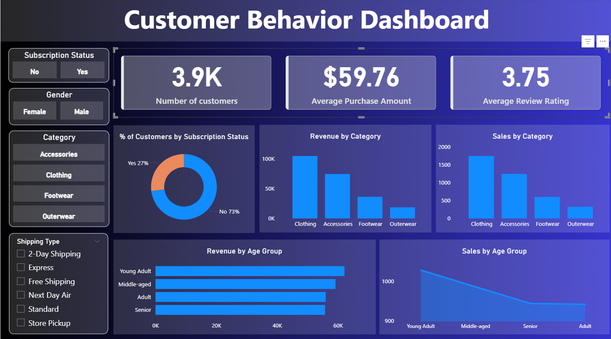

📊 Customer Shopping Behavior Analysis

An end-to-end data analytics project analyzing 3,900+ customer transactions to uncover actionable insights on revenue, customer segmentation, subscription behavior, and product performance.

Cleaned and transformed raw data using Python (Pandas), performed business-focused analysis using PostgreSQL (SQL), and developed an interactive Power BI dashboard to support data-driven decision-making.

🔎 Key Insights

- Revenue contribution by gender and age group
- Subscriber vs non-subscriber spending comparison
- Customer segmentation (New, Returning, Loyal)
- Top-performing and high-rated products
- Discount and shipping impact analysis

🛠 Tech Stack

Python | SQL | PostgreSQL | Power BI

📊 Dashboard Preview 

